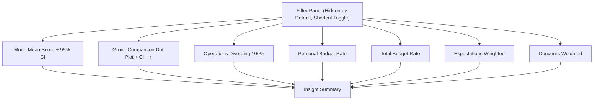

# 졸업전시 설문 대시보드 웹 스펙 v1.5

- 최종 업데이트: 2026-03-05

## 1) 문서 개요
- 문서 목적: 설문 결과를 분류 필터 기반으로 해석 가능한 반응형 리포트 웹페이지의 제품/디자인/기술 스펙을 정의한다.
- 대상 프로젝트: `2602_graduation-survey`
- 대상 데이터: `survey.xlsx` -> `survey-data.js`
- 주요 산출물: 단일 페이지 대시보드(`index.html`) + 데이터 변환 스크립트(`scripts/build_survey_data.py`)

### 1.1 범위(In Scope)
- 세부전공/스튜디오/과정 필터
- 전시 방식 평균 점수+신뢰구간, 기대/우려 가중 점수 시각화
- 비용/운영 태도/핵심 인사이트 표시
- 데스크톱/태블릿/모바일 반응형 대응

### 1.2 범위 제외(Out of Scope)
- 로그인/권한 관리
- 서버 DB 저장/관리
- 실시간 협업 기능
- 고급 통계 모델링(회귀, 군집, 예측)

### 1.3 성공 기준
- 필터 조합 변경 시 차트/인사이트가 일관되게 동기화된다.
- 회의 참여자가 3분 내 전시 방식 선호와 리스크 상위 항목을 파악할 수 있다.
- 모바일에서도 주요 의사결정 지표 확인이 가능하다.

## 2) 사용자 및 사용 시나리오
### 2.1 주요 사용자
- 졸업준비위원회 임원
- 스튜디오 대표/지도교수 협의 참여자
- 일반 졸업예정생

### 2.2 핵심 질문
- 어떤 전시 방식이 전체/집단별로 우세한가?
- 선호 방식과 비용 수용 범위가 충돌하는가?
- 운영 참여 의사와 우려 항목 간 리스크는 무엇인가?

### 2.3 대표 시나리오
1. 사용자: 과정=예술사, 특정 스튜디오 선택
2. 확인: 전시 방식 평균 점수(95% CI), 비용 수용 비율, 운영 태도 분포 확인
3. 판단: 기대/우려 상위 항목 및 인사이트 문장으로 회의 안건 도출

## 3) 정보 구조(IA) 및 화면 구성
### 3.1 페이지 레이아웃
- 기본: 차트 그리드 + 핵심 인사이트
- 필터 패널: 기본 숨김(off-canvas), 관리자 단축키로 열기/닫기
- 모든 비교 차트에 표본수(`n`)를 함께 표시
- 최상단 제목(히어로) 카드는 사용하지 않는다.

### 3.2 섹션 우선순위
1. 전시 방식 비교(평균 점수 + 95% CI)
2. 분류별 비교(점+오차범위+n)
3. 비용/운영 실행성(분포형 중심)
4. 기대/우려 요인
5. 자동 인사이트 문장

### 3.3 와이어프레임
#### 데스크톱(기본 콘텐츠 + 숨김 필터 패널)
```text
+--------------------------------------------------------------+
| Main Content                                                  |
| [전시 방식 평균 점수 + 95% CI]   [분류 비교 Dot Plot + CI + n]|
| [운영 태도 Diverging 100%]     [개인 부담 적정 금액 비율]     |
| [총 부담 가능 금액 비율]       [기대 요인(가중점수)]           |
| [우려 요인(가중점수)]                                         |
| 핵심 인사이트(요약 + n 안내)                                  |
+--------------------------------------------------------------+

Admin Shortcut: Ctrl+Alt+F (Windows/Linux) / Cmd+Option+F (macOS)
-> [Filters Panel Overlay]
+---------------------------+
| Filters Panel (off-canvas)|
| - 과정/세부전공/스튜디오    |
| - [전체] [해제]           |
| - [필터 초기화] [닫기]      |
+---------------------------+
```

#### 모바일(단일 컬럼, 필터는 동일 단축키로 오버레이)
```text
+------------------------------------------------+
| 전시 방식 평균 점수 + 95% CI                    |
| 분류 비교 Dot Plot + CI + n                     |
| 운영 태도 Diverging 100%                        |
| 개인 부담 적정 금액 비율                         |
| 총 부담 가능 금액 비율                           |
| 기대 요소                                       |
| 우려 요소                                       |
+------------------------------------------------+
| 핵심 인사이트                                   |
+------------------------------------------------+
```

#### Mermaid 흐름도


## 4) 시각 문법(레퍼런스 스타일 반영)
레퍼런스 이미지의 미니멀 인포그래픽 톤을 현재 대시보드 문법으로 번역한다.

### 4.1 컬러 시스템
- 기반: `Neutral Gray`
- Base Background: `#D7D7DC`
- Surface: `#ECECEF`, `#F4F4F6`
- Text Main: `#17161D`
- Text Muted: `#66646E`
- Border/Grid: `#C9C9D2`, `rgba(26, 24, 34, 0.14)`
- 값 인코딩 스케일: 최소 `#B7A8FB` / 중간 `#F5E7A1` / 최대 `#FC8B57`

### 4.2 타이포그래피
- Display/Numeric 강조: `Space Grotesk`
- 본문/라벨: `IBM Plex Sans KR`
- 문법:
  - 큰 수치(핵심 값) 우선 강조
  - 라벨은 간결한 문구 + 낮은 시각 강도
  - 과도한 장식 폰트 금지

### 4.3 형태/레이아웃 문법
- 카드 중심, 얇은 라인, 저채도 배경
- 컴포넌트 내부 요소 간 위계는 크기/굵기/여백으로 구분
- 배경은 단색 회색(`#D7D7DC`) 유지
- 카드/차트 내부 그라디언트는 사용하지 않는다.

### 4.4 차트 문법
- 축/그리드/툴팁의 색상 체계 통일
- 값 인코딩은 상대 크기 기준(최소/중간/최대 3단 보간)
- 전시 방식은 평균 점수 + 95% CI 우선 표기
- 운영/인력 태도는 Diverging 100% 분포로 표기
- Diverging 100%는 `0`축 중심(`range -100~100`)으로 구성하며, 중립(3)은 좌/우 50:50으로 분할해 배치한다.
- 범례에는 중립 항목을 1회만 노출한다.

## 5) UI 업데이트 계획
### 5.1 업데이트 목표
- 데이터 해석을 우선하는 미니멀 중립 UI 정착
- 필터 접근 제어(기본 숨김 + 관리자 단축키)로 일반 열람 화면 단순화
- 지표 해석의 오해를 줄이는 신뢰구간/분포 중심 표현

### 5.2 단계별 계획
1. Foundation 정리
- 디자인 토큰(색/타이포/여백) 고정
- 공통 차트 레이아웃 함수 적용
- 완료 기준: 모든 차트/카드 스타일 일관성 확보

2. Layout 고도화
- 기본 단일 콘텐츠 레이아웃 + 필터 오버레이
- 필터 패널 오픈/닫기 단축키 및 ESC/백드롭 닫기 동작 추가
- 완료 기준: 스크롤/반응형 전환 시 레이아웃 깨짐 없음

3. Component 통일
- 차트/인사이트 카드 시각 규칙 통일
- 필터 버튼 상태(hover/active/focus) 정리
- 완료 기준: 상태별 대비/가독성 기준 충족

4. 데이터 해석 강화
- 전시 방식: 가중 점수를 평균 점수 + 95% CI 카드로 전환
- 분류 비교: 히트맵 대신 Dot Plot + n + 오차범위로 전환
- 운영 태도: 평균 막대 대신 Diverging 100% 분포로 전환
- 비용: 개인 부담/총 부담을 별도 카드로 분리
- 인사이트 문장: 과정별 비교, 기대/우려 상위, 비용 최빈값 자동 서술
- 완료 기준: 필터 변경 시 인사이트 논리 일관성 유지

5. QA 및 미세 조정
- 브라우저/디바이스 점검
- 대비/키보드 포커스/차트 라벨 중첩 점검
- 완료 기준: 체크리스트 항목 100% 통과

## 6) 컴포넌트 스펙
### 6.1 필터 패널
- 목적: 데이터 분류 축 제어
- 그룹: 과정, 세부전공, 스튜디오
- 동작:
  - 멀티 선택 체크박스
  - 그룹별 `전체` / `해제`
  - 전역 `필터 초기화`
  - `Ctrl+Alt+F`(Win/Linux), `Cmd+Option+F`(macOS)로 열기/닫기
  - `Esc`, 백드롭 클릭, `닫기` 버튼으로 닫기
- 위치:
  - 데스크톱/모바일 공통: off-canvas 오버레이
  - 기본 상태: 숨김

### 6.2 차트 카드
- 전시 방식 선호 평균 점수 + 95% CI(Dot Plot)
- 분류 비교 Dot Plot + 오차범위 + `n` 표기
- 개인 부담 적정 금액(유효응답 기준 비율 막대)
- 총 부담 가능 금액(유효응답 기준 비율 막대)
- 운영/인력 태도 분포(Diverging 100% stacked bar)
- 기대 요소/우려 요소(가중 점수 수평 막대)

### 6.3 문항 텍스트 표시 규칙
- 다음 4개 카드에는 제목 하단에 질문 원문을 고정 표시한다(토글/축약 없음).
  - 개인 부담 적정 금액 카드: `오프라인 전시 진행을 위해 졸업예정생 개인 부담금이 발생할 경우, 적정한 금액은 얼마일까요?`
  - 총 부담 가능 금액 카드: `오프라인 전시 진행을 위해 부담할 수 있는 총 금액은 얼마이신가요?`
  - 기대 요소 카드(공통 질문): `졸업전시에서 기대하는 점은 무엇인가요?`
  - 우려 요소 카드(공통 질문): `졸업전시 준비 과정에서 가장 우려되는 점은 무엇인가요?`

### 6.4 인사이트 카드
- 규칙 기반 요약 문장 5~6개 표시
- 필터 결과가 0건이면 안내 문구 표시
- 문장 구성 원칙:
  - 선호(전시 방식) 1문장, 실행성(운영/예산) 2문장, 리스크(우려) 1문장, 분화(집단 차이) 1문장
  - 가능한 경우 수치(평균/비율/순위점수) 포함
  - 표본이 작은 필터(`n<5`)에서는 단정형 표현 대신 탐색형 표현 사용

## 7) 데이터/분석 스펙
### 7.1 데이터 파이프라인
1. 입력: `survey.xlsx`
2. 변환: `scripts/build_survey_data.py`
3. 출력: `survey-data.js` (`window.SURVEY_DATA`)

### 7.2 집계 규칙
- 순위형 가중치: `1순위=3`, `2순위=2`, `3순위=1`, 무응답=0
- 순위형 문항은 설계상 상위 3개만 응답하므로, 남는 1개 선택지의 미기입은 결측이 아니라 구조적 미선택으로 처리한다.
- 평균형 문항: 유효 숫자만 평균
- 복수 선택형: 선택 항목별 카운트 누적
- 분류 필터: AND 조건(과정 ∩ 세부전공 ∩ 스튜디오)

### 7.3 인사이트 생성 규칙
- 전시 방식: 평균 점수(0~3) 최상위 항목 표기
- 기대/우려: 가중 점수 상위 1개씩 표기
- 비용: 개인 부담 선택 최빈값 표기
- 과정별: 과정 단위 최상위 전시 방식 비교 문장 생성
- 실행-선호 분리 규칙:
  - 오프라인 전시 입장 평균과 운영 참여 의사 평균의 관계를 함께 점검해, 선호와 실행 의지의 분리를 문장으로 명시
- 분화 규칙:
  - 예산 구간(저부담/중간부담/고부담)별 상위 전시 방식이 달라지면 분화 문장 우선 출력

## 8) 반응형 스펙
- Breakpoint A: `<=980px`
  - 차트 카드 full width
  - 질문 텍스트(`chart-question`)는 줄바꿈 유지
  - 필터 오버레이 폭/높이 축소
- Breakpoint B: `<=580px`
  - 컨테이너 폭 축소
  - 차트 높이 260px

## 9) 접근성/가독성 스펙
- 텍스트 대비: 본문/라벨/버튼 상태 대비 유지
- 포커스 가시성: 버튼/체크박스 키보드 탐색 시 시각 표시 유지
- 정보 중복 제공: 차트 외 인사이트 텍스트 병행
- 라벨 명확성: 축 타이틀과 단위 명시

## 10) 성능/기술 스펙
- 렌더링 방식: 정적 파일 + 클라이언트 집계
- 라이브러리: Plotly CDN
- 초기 성능 목표:
  - 필터 변경 후 시각 업데이트 체감 300ms 내
  - 응답 수가 3배 증가해도 인터랙션 지연 최소화

## 11) QA 체크리스트
- 필터 조합별 응답 수/차트 값 정합성
- 가중 점수 계산값 수동 검산 샘플 일치
- 0건 필터 상태 예외 처리
- 데스크톱/모바일 레이아웃 정상 동작
- 질문 원문 고정 표시 가독성 확인
- 제목(히어로) 카드 미노출 확인
- 카드/차트 그라디언트 미사용 확인
- 운영/인력 Diverging 차트의 `0`축 중심 정렬 확인
- 필터 패널 단축키 토글/ESC/백드롭 닫기 동작 확인

## 12) 릴리즈/운영 가이드
### 12.1 데이터 갱신 절차
```bash
python3 scripts/build_survey_data.py --input survey.xlsx --output survey-data.js
python3 -m http.server 8000
```

### 12.2 버전 관리 규칙
- 스펙 변경 시 문서 상단 버전/날짜 업데이트
- 집계 로직 변경 시 `7) 데이터/분석 스펙` 동시 수정

### 12.3 향후 확장 후보
- 자유서술 코멘트 태깅(예산/공정성/접근성)
- 필터 프리셋 저장
- 회의용 PDF 요약 자동 내보내기

## 13) 통계 수치 초안 (현재 데이터 기준)
아래 수치는 현재 `survey-data.js` 기준의 초안이며, 데이터 갱신 시 변경될 수 있다.

### 13.1 표본 및 구조
- 전체 응답 수: `N=26`
- 과정 분포: 예술사 23명(88.5%), 전문사 3명(11.5%)
- 세부전공 분포: 인터랙션 8, 제품 7, 커뮤니케이션 5, 운송 3, 융합 3
- 스튜디오 분포: 7/7/6/3/2/1

### 13.2 핵심 참고 수치(카드 미표시)
- 오프라인 전시 입장 평균(1~5): `3.58`
- 운영 참여 의사 평균(1~5): `3.35`

### 13.3 전시 방식 선호 점수 평균 (0~3, 95% CI)
- 온·오프라인 병행: `2.04` (95% CI `1.69~2.39`)
- 오프라인 전시: `1.73` (95% CI `1.35~2.12`)
- 온라인 전시: `1.46` (95% CI `1.07~1.86`)
- 전시 없음(졸업심사): `1.42` (95% CI `0.96~1.89`)

### 13.4 비용 수용 비율 (유효응답 기준)
개인 부담 적정 금액 (`n=26`):
- 5-10만 원: `38.5%`
- 10-20만 원: `34.6%`
- -5만 원: `19.2%`
- 20-30만 원: `11.5%`
- 40만 원-: `3.8%`
- 부담할 수 없다: `0.0%`

총 부담 가능 금액 (`n=26`):
- 30-50만 원: `42.3%`
- 10-30만 원: `30.8%`
- 100만 원 이상: `23.1%`
- -10만 원: `7.7%`

### 13.5 기대/우려 상위 항목 (가중 점수)
기대 상위:
- 외부 관람객 연결: `61`
- 프로젝트 실물 활용: `41`
- 공식적 마무리 의식: `36`
- 포트폴리오/진로 활용: `36`

우려 상위:
- 의견 조율 어려움: `58`
- 졸업 프로젝트 일정 변화: `44`
- 전시 공동 예산 부족: `41`
- 기획/운영 참여 저조: `35`

### 13.6 해석 메모 (초안)
- 전시 방식은 병행 > 오프라인 > 온라인/전시없음 순으로 나타났으나, CI 중첩이 있어 강한 우열 단정은 보류한다.
- 비용은 개인 부담 `5~20만 원` 구간 집중, 총 부담은 `30~50만 원` 구간 집중 양상이다.
- 우려는 예산 자체보다 `의견 조율`과 `일정 변화`의 운영 리스크가 더 크게 관측된다.
- 순위형 문항은 상위 3개 응답 구조이므로, 미선택 항목 비율은 별도 경고 지표로 해석하지 않는다.

### 13.7 `필터 기준 핵심 인사이트` 문안 초고 v2.5 (전체 필터, N=26)
- 전시 방식 선호를 오프라인 진행 여부 관점으로 재해석하면, 온·오프라인 병행(평균 2.04, 53점)과 오프라인 전시(평균 1.73, 45점)는 모두 오프라인 포함 선택지로서 합산 가중점수 98점을 보이며, 오프라인 비포함 선택지인 온라인 전시(평균 1.46, 38점)와 전시 없음(평균 1.42, 37점)의 합 75점보다 높다. 
- 예산은 `개인 부담 5~20만 원`(73.1%)에 집중되며, 총 부담 가능 금액은 `30~50만 원`(42.3%)이 최빈이다.
- 기대 요인의 중심은 `외부 관람객 연결`(61점)이고, 우려 요인의 중심은 `의견 조율 어려움`(58점)이다. 
- 과정별로는 `예술사`가 병행(2.17)을, `전문사`는 오프라인(2.33)을 상위로 보인다. 단, 전문사 표본은 `n=3`으로 해석시 방향성 수준으로만 취급한다.
- 예산 구간별 선호 분화가 뚜렷하다. `0~5만 원` 그룹은 `전시 없음`(2.80) 성향이 강하고, `5~20만 원` 그룹은 `병행`(2.33)을 선호한다. 전시 방식 논의는 예산 논의와 분리하지 않는 것이 타당하다.
- `오프라인 전시 입장`과 `운영 참여 의사`의 상관은 거의 0에 가깝다(피어슨 r≈0.02). 오프라인 찬성이 곧 운영 참여를 의미하지 않으므로, 참여 유도 장치(역할 정의/보상/업무 분배)를 별도로 설계해야 한다.
